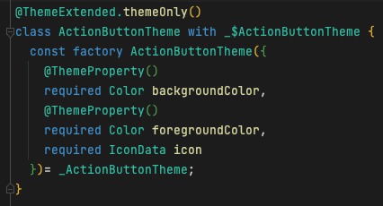
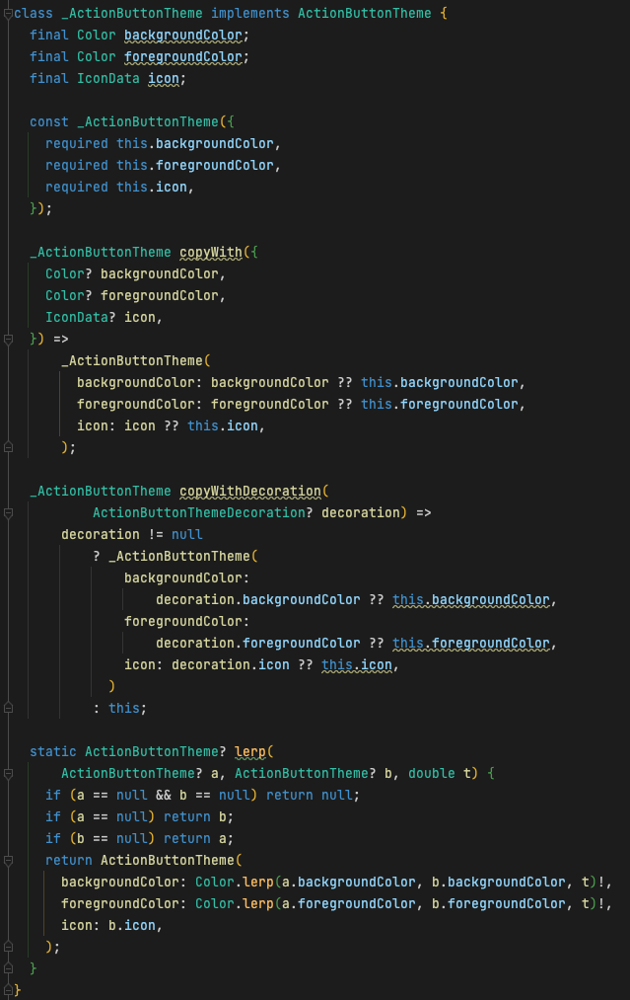

# Motivation

Flutter provides awesome mechanism for extending a standard theme - Theme extensions. Adding your own extension includes the following steps:

- Создание класса-контейнера, удовлетворяющего интерфейсу `ThemeExtension<T>` для хранения параметров расширения,
- Описание анимации контейнера при изменении темы с помощью переопределения метода `lerp`,
- Описание поведения контейнера при изменении свойств с помощью методы `copyWith`,
- Опционально, возможно создать расширение для класса `ThemeData`, которое позволит лаконично доставать текущую тему из контекста.

Реализация всего этого может занять сотни строк, что чревато ошибками и существенно влияет на удобочитаемость. Стоит учесть, что Flutter также предоставляет встроенный метод `lerp` для многих встроенных структур. К сожалению классы, имеющие этот метод, не объединены каким либо интерфейсом, что усложняет корректное использование данного функционала. Для числовых типов в Dart также существует `Tween` с похожей функциональностью. 

Структуры, имеющие `lerp`:

- AlignmentGeometry,
- Alignment,
- BorderRadius,
- Border,
- BoxConstraints,
- Color,
- Decoration,
- EdgeInsetsGeometry,
- EdgeInsets,
- FractionalOffset,
- Offset,
- Matrix4,
- Rect,
- RelativeRect,
- ShapeBorder,
- Size,
- TextStyle,
- ThemeData.

Все они поддерживаются данным автогенератором.

| You write                     | Autogen do                       |
|-------------------------------|----------------------------------|
|     |          |

# Index

- [Motivation](#motivation)
- [Index](#index)


# How to use

## Install

To use ThemeExtensions Generator you will need your typical code-generator setup.

This installs three packages:

- [build_runner](https://pub.dev/packages/build_runner), the tool to run code-generators
- theme_extensions_generator, the code generator
- theme_extensions_annotation, a package containing annotations for theme_extensions_generator.

## Run the generator

To run the code generator, execute the following command:

```
dart run build_runner build
```

For Flutter projects, you can also run:

```
flutter pub run build_runner build
```

Note that like most code-generators, theme_extensions_generator will need you to both import the annotation (theme_extensions_annotation)
and use the `part` keyword on the top of your files.

As such, a file that wants to use theme_extensions_generator will start with:

```dart
import 'package:theme_extensions_annotation/theme_extensions_annotation.dart';

part 'my_file.g.dart';

```

## Creating a theme using generator

An example of a typical theme_extensions_generator class:

```dart
import 'package:flutter/material.dart';
import 'package:theme_extensions_annotation/theme_extension_annotation.dart';

part 'custom_theme.g.dart';

@ThemeExtended.themeOnly()
class ActionButtonTheme with _$ActionButtonTheme {
  const factory ActionButtonTheme({
    @ThemeProperty()
    required Color backgroundColor,
    @ThemeProperty()
    required Color foregroundColor,
    required IconData icon
  })= _ActionButtonTheme;
}

@ThemeExtended()
class CustomTheme with _$CustomTheme {
  const factory CustomTheme({
    @ThemeProperty()
    required Color backgroundColor,
    @ThemeProperty()
    required Color foregroundColor,
    @ThemeProperty()
    required Color textColor,
    @ThemeProperty()
    Alignment? textAlign,
    @ThemeProperty.styled()
    required ActionButtonTheme actionButtonTheme,

    required String themeName
  })= _CustomTheme;
}
```


The following snippet defines two themes named `ActionButtonTheme` and `CustomTheme`:

- `ActionButtonTheme` has 3 properties `backgroundColor`, `foregroundColor` and `icon`
- `CustomTheme` has 6 properties `backgroundColor`, `foregroundColor`, `textColor`, `textAlign`, `actionButtonTheme` and `themeName`
- `actionButtonTheme` has `@ThemeProperty.styled()`, it means that field supports specific `lerp` method
- Because we are using `@ThemeExtended`, some code will also automatically generate:
  - a `copyWith` method, for cloning the object with different properties
  - a `copyWithDecoration` this method also cloning the object with different properties, but in this case properties contains in "decoration"-structure 
  - a `lerp` method, that generate specific `lerp` for lerpable types.
  - a `ThemeData` extension for easy access
- `ActionButtonTheme` uses `@ThemeExtended.themeOnly()`, so `ThemeExtension` class and `ThemeData` extension for this class will not be generated
- `icon` in `ActionButtonTheme` and `themeName` in `CustomTheme` don't have annotation, therefore, specific `lerp` will not be generated for some fields

### Usage in UI

Для использования в виджете вам необходимо просто получить расширение темы через extension of `ThemeData`: 

```dart
class MyHomePage extends StatelessWidget {
    const MyHomePage({super.key});

@override
Widget build(BuildContext context) {
    var theme = Theme.of(context)
        .yourThemeExtension

    return ...
    }
}

```

### What is decoration type

Декоративный тип является инструментом, который как просто помогает быстро переопределять поля, задающиеся темой, так и облегчает передачу параметров в конструктор виджета. Декоративные контейнеры имеются и в стандартных Flutter виджетах:

```dart
Container(
    decoration: BoxDecoration(
    color: Colors.orange,
    border: Border.all(
        color: Colors.pink[800],
        width: 3.0),
    borderRadius: BorderRadius.all(
        Radius.circular(10.0)),
    boxShadow: [BoxShadow(blurRadius: 10,color: Colors.black,offset: Offset(1,3))],
    ...
    ),
    child: ...
)
```

theme_extensions_generator генерирует для вас простые структуры вроде:

```dart
class CustomThemeDecoration {
  final Color? backgroundColor;
  final Color? foregroundColor;
  final Color? textColor;
  final Alignment? textAlign;
  final ActionButtonTheme? actionButtonTheme;
  final String? themeName;

  const CustomThemeDecoration({
    this.backgroundColor,
    this.foregroundColor,
    this.textColor,
    this.textAlign,
    this.actionButtonTheme,
    this.themeName,
  });
}
```
Которые после вы можете использовать при конструировании виджета для переопределения темы:

```dart
class MyHomePage extends StatelessWidget {
    const MyHomePage(
        {super.key,
        this.decoration});

    final YourThemeDecoration? decoration;

@override
Widget build(BuildContext context) {
    var theme = Theme.of(context)
        .yourThemeExtension
        .copyWithDecoration(widget.decoration);

    return ...
    }
}
```
### Lerpable types

Генератор поддерживает все строенные типы, имеющие собственную реализацию `lerp` и автоматически использует их методы. Если для типа не найден `lerp` метод или, если поле не содержит аннотации, оно будет изменяться мгновенно простым копированием:

```dart
static ActionButtonTheme? lerp(
    ActionButtonTheme? a, ActionButtonTheme? b, double t) {

    if (a == null && b == null) return null;
    if (a == null) return b;
    if (b == null) return a;
    return ActionButtonTheme(
        //Has annotation and built-in lerp method
        backgroundColor: Color.lerp(a.backgroundColor, b.backgroundColor, t)!,
        //Has annotation and built-in lerp method
        foregroundColor: Color.lerp(a.foregroundColor, b.foregroundColor, t)!,
        //Has not annotation or built-in lerp method
        icon: b.icon,
    );
}
```

Генератор имееет аннотацию `@ThemeProperty.styled()`, явно говорящую о том, что тип имеет `lerp` метод, удовлетворяющий интерфейсу:
```dart
static CustomType? lerp(CustomType? a, CustomType? b, double t)
```

### ThemeExtension and ThemeData extension. Nested Declaration

По умолчанию при использовании аннотации `@ThemeExtended()` будут сгенерированы `ThemeExtension` контейнер и расширение для `ThemeData`. В случае, если вы не имеете в них необходимости (например, если тема является вложенной), вы можете использовать аннотацию `@ThemeExtended.themeOnly()`. В таком случае они не будут сгенерированы.

## ThemeExtension initializing and registration

Согласно документации Flutter, для регистрации расширения темы, вам необходимо добавить сгенерированный `ThemeExtension` класс, так, как это показано на примере ниже:

```dart
class Example extends StatelessWidget {

    CustomTheme lightTheme = const CustomTheme(
        backgroundColor: Colors.white,
        foregroundColor: Colors.blue,
        textColor: Colors.black,
        themeName: 'Light',
        actionButtonTheme: ActionButtonTheme(
            backgroundColor: Colors.blueAccent,
            foregroundColor: Colors.black,
            icon: Icons.add));

    CustomTheme darkTheme = const CustomTheme(
        backgroundColor: Colors.black87,
        foregroundColor: Colors.blue,
        textColor: Colors.white,
        textAlign: Alignment.centerRight,
        themeName: 'Dark',
        actionButtonTheme: ActionButtonTheme(
            backgroundColor: Colors.blueAccent,
            foregroundColor: Colors.white,
            icon: Icons.add));

    Widget build(BuildContext context) {
        return MaterialApp(
            title: 'Flutter Demo',
            theme: ThemeData(extensions: [
                CustomThemeExtension(someSwitch ? lightTheme : darkTheme)
            ]),
            home: ...
        );
    }
}
```